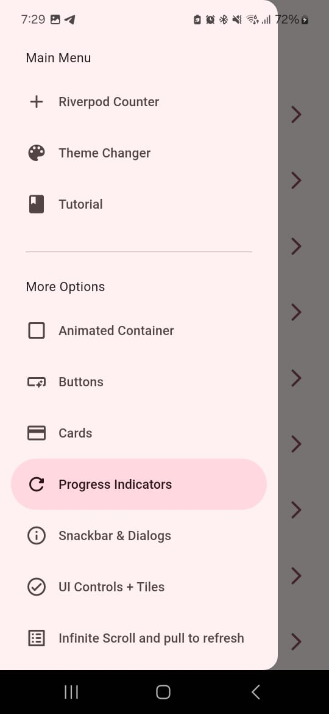

# 🚀 WidgetLab - Flutter Widgets Showcase App 

Welcome to **WidgetLab**, a Flutter-based application designed to showcase and experiment with a wide range of widgets and UI controls. The app features an options list along with a side menu (drawer) that displays the same options, providing easy access to each interactive example.

## 🔍 Features 

- **Buttons Demo**:  
  Demonstrates various types of buttons:
  - FilledButton
  - ElevatedButton
  - OutlinedButton
  - TextButton
  - IconButton
  - FloatingActionButton
  - Custom Button

- **Cards**:  
  Examples of cards showcasing different styles:
  - Outlined cards
  - Elevated cards
  - Cards with a background image from [Picsum](https://picsum.photos)

- **Progress Indicators**:  
  Displays both controlled and uncontrolled progress indicators.

- **Animated Demo**:  
  Illustrates Flutter animations with an example of `AnimatedContainer`.

- **App Tutorial**:  
  A PageView with a controller that provides a mini introduction to a delivery app, complete with a concluding button.

- **Snackbars and Dialogs**:  
  Demonstrates:
  - Snackbar functionality
  - AlertDialog usage
  - Implementation of showAboutDialog

- **UI Controls**:  
  Showcases the usage of:
  - SwitchListTile
  - ExpansionTile
  - RadioListTile
  - CheckboxListTile

- **Infinite Scroll**:  
  Implements a finite scroll that loads images from [Picsum](https://picsum.photos) with pull-to-refresh and load next page functionalities, enhanced with animations using *animate_do*.

- **Counter**:  
  A counter with refresh capability, built with Riverpod.

- **Theme Changer**:  
  Allows toggling between light and dark themes and colors, all managed using Riverpod.

- **Simplified Navigation**:  
  Navigation throughout the application is handled by **go_router** for a smooth and organized experience.

## 📷 Screenshots





## 💻 Requirements

- **Flutter SDK**: Version 3.0.0 or higher  
- **Dart**: Version 2.17.0 or higher

## 💻 Installation

1. **Clone the repository**:
   ```bash
   git clone https://github.com/lauritaila/flutter_widgets_app.git
2. **Navigate to the project directory**:
   ```bash
   cd tok_tik_app
3. **Install dependencies**:
   ```bash
   flutter pub get
4. **Run the app**:
   ```bash
   flutter run

## 📂 Project Structure (Clean Architecture Inspired)

The app follows a basic structure inspired by Clean Architecture, separating concerns into layers:

```
flutter_widgets_app/
├── lib/
│   ├── main.dart               # Entry point of the application
│   ├── config/                 # Configuration and utilities
│   │   ├── theme/              # App theme (colors, fonts, etc.)
│   │   ├── router/             # Navigation and routing
│   │   └── menu/               # App menu items
│   ├── presentation/           # Presentation layer (UI and state management)
│   │   ├── screens/            # App screens (pages)
│   │   ├── widgets/            # Reusable UI components
│   │   └── providers/          # State management (using Provider)
├── assets/                     # Static assets (e.g., videos)
└── pubspec.yaml                # Project dependencies
```

## 📂 Dependencies


- 🎬 **animate_do** ([animate_do](https://pub.dev/packages/animate_do)) (^4.1.1): Adds interactive animations to the UI.
- 🌊 **flutter_riverpod** ([flutter_riverpod](https://pub.dev/packages/flutter_riverpod)) (^2.6.1): Efficient and reactive state management.
- 🗺️ **go_router** ([go_router](https://pub.dev/packages/go_router)) (^14.8.0): Simplifies navigation and route management.

## 😊 Contributing
Contributions are welcome! If you have any ideas to improve the app, please open an issue or submit a pull request.

